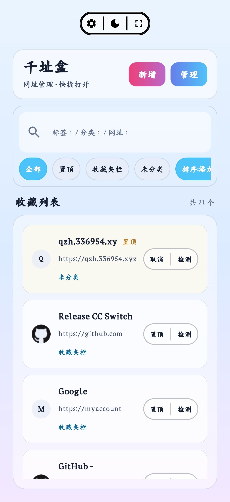
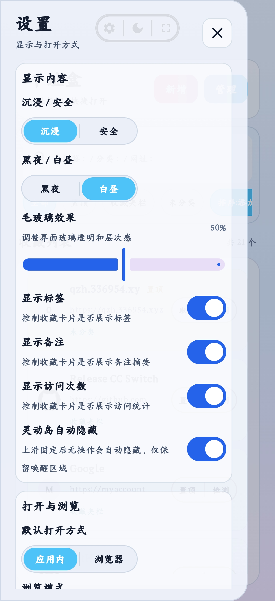
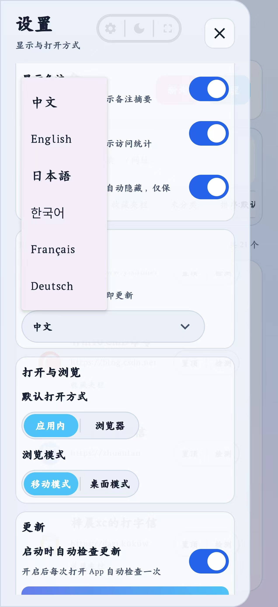
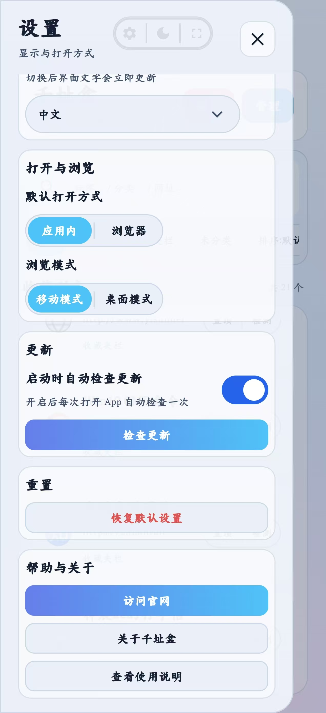
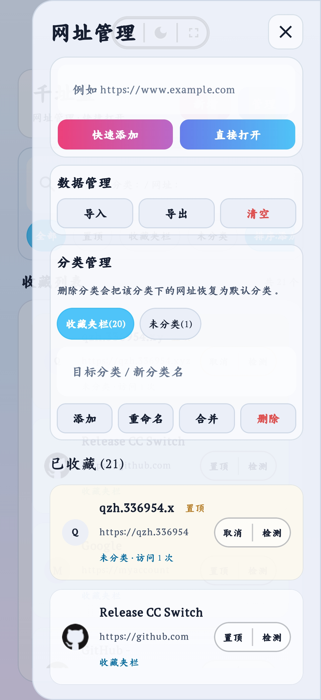
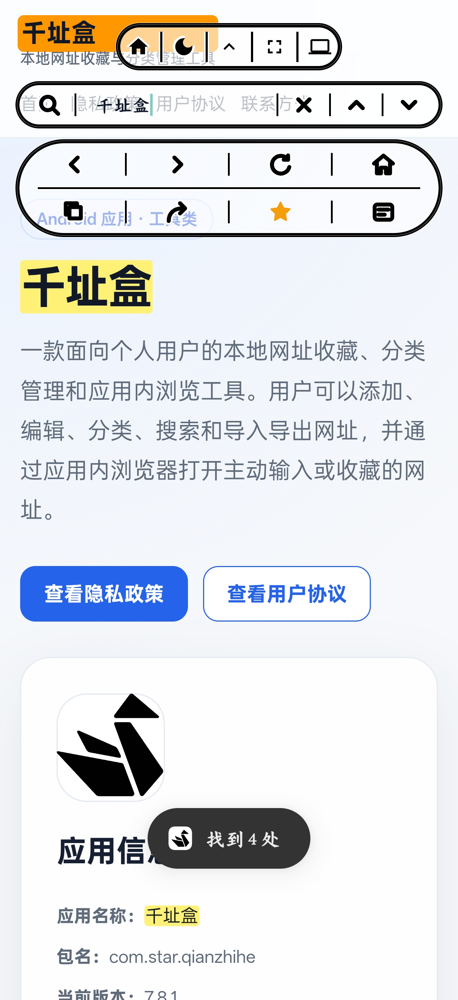

# QianZhiHe（千址盒）

<div align="center">


**Android 向けのローカル優先ブックマーク管理・カテゴリ整理・アプリ内ブラウザツール**

[中文](README_CN.md) · [English](README.md) · [日本語](README_JA.md)

[公式サイト](https://qzh.336954.xyz/) · [プライバシーポリシー](https://qzh.336954.xyz/privacy.html) · [ユーザー契約](https://qzh.336954.xyz/agreement.html) · [最新版をダウンロード](https://github.com/wstar31/qianzhihe-site/releases/latest)

</div>

> QianZhiHe（千址盒）は、個人利用向けの Android ブックマーク管理アプリです。URL の保存、カテゴリ整理、検索、インポート/エクスポート、アプリ内ブラウジングに重点を置いています。データは主にユーザー端末内に保存され、アカウント登録やログイン機能はなく、ブックマークデータを開発者サーバーへ能動的にアップロードすることはありません。

---

## 現在のバージョン

| 項目 | 内容 |
|------|------|
| アプリ名 | QianZhiHe / 千址盒 |
| パッケージ名 | `com.star.qianzhihe` |
| 現在のバージョン | `7.8.4` |
| versionCode | `784` |
| 最低 Android バージョン | Android 8.0 / API 26 |
| Target SDK | API 36 |
| 公式ドメイン | `qzh.336954.xyz` |

## ダウンロード

最新版 APK は GitHub Releases からダウンロードできます：

- [GitHub Releases](https://github.com/wstar31/qianzhihe-site/releases/latest)
- [v7.8.4 APK](https://github.com/wstar31/qianzhihe-site/releases/download/v7.8.4/qianzhihe_7.8.4_release.apk)
- [更新マニフェスト update.json](https://qzh.336954.xyz/release/update.json)

> Android が「署名が競合するアプリが既にインストールされています」と表示する場合、同じパッケージ名で異なる署名証明書の APK が端末に存在します。先に旧バージョンでデータをエクスポートし、旧バージョンをアンインストールしてから新しい APK をインストールしてください。

---

## 概要

QianZhiHe は、よく使う URL をローカルで管理するためのアプリです。ユーザーは URL、タイトル、カテゴリ、タグ、メモを保存でき、検索、カテゴリフィルタ、ピン留め、アクセス統計によって目的のブックマークをすばやく見つけられます。

アプリには WebView ベースのアプリ内ブラウザも搭載されています。保存済みリンクやユーザーが入力した URL を開き、ページ内検索、リンクコピー、共有、現在ページのお気に入り登録、デスクトップ/モバイルモード切り替え、複数ページ管理などを利用できます。

## 主な機能

- **ローカルブックマーク保存**：URL、タイトル、カテゴリ、タグ、メモ、ピン留め状態、アクセス統計を保存。
- **カテゴリ管理**：カテゴリごとの整理、名前変更、統合、削除に対応。
- **検索とフィルタ**：タイトル、URL、タグ、メモ、カテゴリで検索。
- **並び替えとピン留め**：ピン留め、最近のアクセス、最近の更新を優先して表示。
- **インポート/エクスポート**：Markdown、JSON、ブラウザブックマーク HTML 形式に対応。
- **アプリ内ブラウザ**：WebView でページを開き、戻る/進む、更新、ホーム、コピー、共有、お気に入り登録に対応。
- **デスクトップ/モバイル表示モード**：デスクトップ UA とモバイル表示を切り替え可能。タブレットや横画面での拡大縮小にも対応。
- **HTTPS 優先読み込み**：スキームなし URL は既定で HTTPS として補完し、必要に応じて HTTP にフォールバック。
- **ダイナミックアイランド風ツールバー**：ホーム画面とブラウザに、ドッキング、スワイプ非表示、自動非表示に対応した上部フローティングツールバーを提供。
- **ダーク/ライトテーマ**：黒夜/白昼のテーマ切り替えに対応。
- **没入/安全表示モード**：システムバーの表示方式を切り替え可能。
- **自動更新チェック**：サイト上の `update.json` を読み込み、新しい APK のダウンロードとインストールを案内。

## スクリーンショット

### ホームとブックマークリスト

ホーム画面では、保存した URL の追加、検索、フィルタ、起動を行えます。上部のフローティングツールバーから設定、テーマ切り替え、没入/安全表示を操作できます。

<p align="center">
  
</p>

### 設定

設定ドロワーは連続したスクリーンショットで表示し、表示オプション、ブラウザ動作、更新確認、リセット操作、ヘルプ/情報入口をまとめて示しています。

<p align="center">
  
  
  
</p>

### URL 管理

管理ドロワーでは、クイック追加、直接開く、インポート/エクスポート、データ削除、カテゴリ管理を行えます。

<p align="center">
  
</p>

### アプリ内ブラウザ

内蔵ブラウザは、デスクトップ/モバイルモード、ページ内検索、戻る/進む、更新、ホーム、コピー、共有、お気に入り、複数ページ管理に対応しています。

<p align="center">
  
</p>

---

## 技術スタック

| 領域 | 技術 |
|------|------|
| プラットフォーム | Android |
| 言語 | Kotlin + Java |
| UI | Jetpack Compose + XML View |
| アーキテクチャ | MVVM / ViewModel / Flow |
| データベース | Room |
| ブラウザ | Android WebView / AndroidX WebKit |
| 画像読み込み | Coil Compose |
| ビルド | Gradle Kotlin DSL / Android Gradle Plugin |
| 最低 JDK | Java 17 |

---

## プロジェクト構成

```text
QZH/
├── app/                                      # Android アプリモジュール
│   ├── build.gradle.kts                     # ビルド設定、バージョン、署名設定
│   └── src/
│       ├── main/
│       │   ├── AndroidManifest.xml          # 権限、Activity、FileProvider
│       │   ├── java/com/star/qianzhihe/
│       │   │   ├── MainActivity.kt          # アプリ入口と Compose ホーム画面
│       │   │   ├── BrowserActivity.java     # アプリ内ブラウザ
│       │   │   ├── AppPrefs.kt              # ローカル設定
│       │   │   ├── UpdateManager.kt         # 更新確認、APK ダウンロード、インストール
│       │   │   ├── data/                    # Room データベース、DAO、Entity
│       │   │   ├── ui/main/                 # ホーム UI、ドロワー、カード、インポート/エクスポート
│       │   │   └── ui/theme/                # テーマ、色、フォント
│       │   └── res/                         # XML レイアウト、アイコン、リソース
│       └── test/                            # ユニットテスト
├── assets/                                  # README 用素材とスクリーンショット
│   └── screenshots/
├── release/                                 # ローカルリリースマニフェストと APK フォルダ
│   ├── update.json
│   └── download/
├── gradle/                                  # Gradle バージョンカタログ
├── key/                                     # ローカル署名キー。リポジトリには含めない
└── README.md
```

---

## データモデル

中心となる Room テーブルは `site_table` で、Entity は `SiteItem` です。

| フィールド | 説明 |
|------------|------|
| `title` | ブックマークタイトル |
| `url` | 元の URL |
| `normalizedUrl` | 重複排除と照合用の正規化 URL |
| `category` | カテゴリ |
| `tags` | タグ文字列 |
| `note` | メモ |
| `isPinned` | ピン留め状態 |
| `visitCount` | アクセス回数 |
| `lastVisitedAt` | 最終アクセス時刻 |
| `openMethod` | 開き方：自動、アプリ内、外部ブラウザ |
| `updatedAt` | 最終更新時刻 |

---

## インポート/エクスポート形式

### Markdown

標準 Markdown リンクとプレーン URL に対応しています：

```markdown
- [GitHub](https://github.com/)
- https://example.com
```

エクスポート時はカテゴリ、タグ、メモも含まれます：

```markdown
- [GitHub](https://github.com/)
  - Category: Development
  - Tags: code, open source
  - Note: Common code hosting platform
```

> 現在のアプリ内エクスポートラベルは、多言語対応が完了するまで内蔵の中国語 UI テキストに従う場合があります。

### JSON

JSON はルート配列、または `{ "items": [...] }` 形式に対応しています。

```json
{
  "version": 2,
  "items": [
    {
      "title": "GitHub",
      "url": "https://github.com/",
      "category": "Development",
      "tags": "code,open-source",
      "note": "Common code hosting platform",
      "isPinned": false,
      "visitCount": 0,
      "lastVisitedAt": 0,
      "openMethod": "AUTO"
    }
  ]
}
```

### ブラウザブックマーク HTML

Netscape Bookmark HTML ファイルを解析できます：

```html
<!DOCTYPE NETSCAPE-Bookmark-file-1>
<DL><p>
  <DT><H3>Development</H3>
  <DL><p>
    <DT><A HREF="https://github.com/">GitHub</A>
  </DL><p>
</DL><p>
```

---

## 更新の仕組み

アプリは次のリリースマニフェストから新バージョンを確認します：

```text
https://qzh.336954.xyz/release/update.json
```

マニフェスト例：

```json
{
  "versionName": "7.8.4",
  "versionCode": 784,
  "apkName": "qianzhihe_7.8.4_release.apk",
  "downloadUrl": "https://qzh.336954.xyz/release/download/v7.8.4/qianzhihe_7.8.4_release.apk",
  "releaseNotes": "Update notes...",
  "releasePageUrl": "https://qzh.336954.xyz/release/download/v7.8.4/"
}
```

更新フロー：

1. 現在インストールされているバージョンを読み取る。
2. `update.json` を取得する。
3. `versionCode` を比較する。
4. APK をダウンロードする。
5. ファイル形式、パッケージ名、バージョン情報を検証する。
6. `FileProvider` を使って Android のパッケージインストーラを起動する。

> Android 8.0 以降では、ダウンロードした APK をインストールする前に「不明なアプリのインストール」権限をユーザーが許可する必要があります。

---

## ビルドと実行

### 必要環境

- Android Studio / Android SDK
- JDK 17
- Gradle Wrapper
- Android SDK Platform 36
- Android Build Tools

### クローン

```bash
git clone https://github.com/<owner>/<repo>.git
cd QZH
```

### Debug ビルド

Windows：

```powershell
.\gradlew.bat :app:assembleDebug
```

Linux / macOS：

```bash
./gradlew :app:assembleDebug
```

### Release ビルド

リリース署名には `key/key.properties` を使用できます：

```properties
storeFile=key/qianzhihe-release.jks
storePassword=your_store_password
keyAlias=qianzhihe
keyPassword=your_key_password
```

リリース APK をビルド：

```powershell
.\gradlew.bat clean assembleRelease
```

出力先：

```text
app/build/outputs/apk/release/app-release.apk
```

> `key/` ディレクトリは `.gitignore` により無視されます。署名キーやパスワードを公開リポジトリにコミットしないでください。

---

## リリース手順

`7.8.4` の例：

1. [app/build.gradle.kts](app/build.gradle.kts) のバージョンを更新します。

```kotlin
versionCode = 784
versionName = "7.8.4"
```

2. Release APK をビルドします。

```powershell
.\gradlew.bat clean assembleRelease
```

3. APK をリリースサイト構造へコピーします。

```text
release/download/v7.8.4/qianzhihe_7.8.4_release.apk
```

4. `release/update.json` を更新します。

5. `qianzhihe-site` リポジトリへコミットしてプッシュします。

6. GitHub Release を作成し、APK をアップロードします：

```powershell
gh release create v7.8.4 release/download/v7.8.4/qianzhihe_7.8.4_release.apk `
  --repo wstar31/qianzhihe-site `
  --target main `
  --title "v7.8.4" `
  --notes "Publish v7.8.4 APK" `
  --latest
```

---

## 権限

| 権限 | 用途 |
|------|------|
| `INTERNET` | Web ページを開く、更新確認、APK ダウンロード |
| `REQUEST_INSTALL_PACKAGES` | ダウンロードした APK のインストールを案内 |

アプリは `FileProvider` を使用して、Android パッケージインストーラへ APK ファイルの一時読み取り権限を付与します。

---

## プライバシー

QianZhiHe はローカル優先設計です：

- アカウント登録やログインはありません。
- ブックマークデータは主に端末内の Room データベースに保存されます。
- インポート/エクスポートファイルはユーザーが自分で選択・保存します。
- アプリ内ブラウザは、ユーザーが入力または保存した URL のみを開きます。
- 更新確認では `qzh.336954.xyz` にアクセスしてリリースマニフェストを取得します。
- favicon の読み込みやページ閲覧により、対象サイトまたは第三者のアイコンサービスへリクエストが送信される場合があります。

全文はこちら：

- [プライバシーポリシー](https://qzh.336954.xyz/privacy.html)
- [ユーザー契約](https://qzh.336954.xyz/agreement.html)

---

## 既知の問題

- 端末に同じパッケージ名で異なる署名の APK が既にある場合、Android は直接インストールを拒否します。先にデータをエクスポートし、旧バージョンをアンインストールしてから新しい APK をインストールしてください。
- 一部の Web サイトは WebView、デスクトップ UA、HTTP アクセスを制限する場合があります。アプリは可能な限り案内とフォールバックを行いますが、すべての Web ページが正常に表示されることは保証できません。
- HTTP フォールバックは HTTPS 非対応サイトとの互換性のために用意されています。可能な限り HTTPS の利用を推奨します。

---

## Roadmap

- [ ] スクリーンショットとデモアニメーションを追加
- [ ] より多くのインポート元との互換性を改善
- [ ] バックアップ/復元ガイド機能を追加
- [ ] タブレットと大画面レイアウトを最適化
- [ ] ブラウザのエラーページとネットワーク診断を改善
- [ ] 自動テストを追加
- [ ] UI テキストが安定した後、アプリ内多言語対応を追加

---

## コントリビュート

このプロジェクトは現在、主に個人プロジェクトとして保守されています。以下に関する Issue や Pull Request を歓迎します：

- バグの再現手順
- UI/操作性の提案
- インポート/エクスポート互換性の問題
- ブラウザ互換性の問題
- ドキュメント改善

コード提出前には、次のコマンドの実行を推奨します：

```powershell
.\gradlew.bat :app:compileDebugKotlin :app:compileDebugJavaWithJavac
```

---

## 免責事項

本プロジェクトは、個人のブックマーク管理とローカル整理を目的としています。ユーザーは、第三者 Web サイト、インポートファイル、非公式チャネルから取得した APK の安全性を自分で確認してください。

開発者は、第三者 Web ページの内容、第三者サイトの可用性、ユーザーがインポートしたデータ、または公式リリース以外の APK によって発生した問題について責任を負いません。

---

## License

このリポジトリには現在、明示的なオープンソースライセンスは設定されていません。公開協力や再配布が必要な場合は、まず `LICENSE` ファイルを追加し、許可範囲を明確にしてください。

---

<div align="center">

**このプロジェクトが役に立った場合は、Star をいただけると嬉しいです。**

</div>
